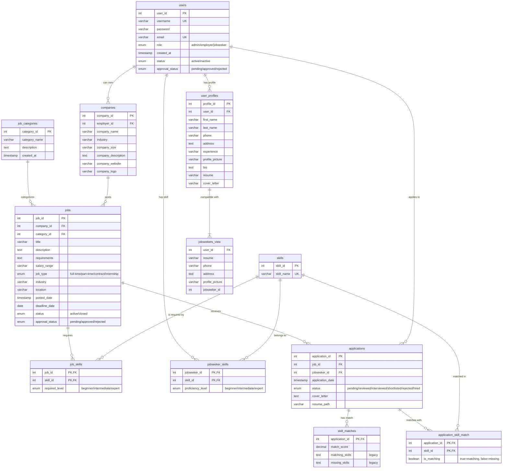

# Normalized Database ERD Diagram

This diagram shows the Entity-Relationship model of the job portal database after normalization.

## Key Improvements in the Normalized Design

1. **User data consolidated**:
   - All user profile information is now in `user_profiles` table
   - The `jobseekers_view` provides backward compatibility

2. **Bridge tables for many-to-many relationships**:
   - `job_skills` connects jobs to required skills
   - `jobseeker_skills` connects users to their skills
   - `application_skill_match` provides a normalized way to store skill matches

3. **Foreign key constraints**:
   - All relationships are properly defined with foreign keys
   - Appropriate ON DELETE actions prevent orphaned records

4. **Improved data integrity**:
   - No more comma-separated lists (1NF compliant)
   - No redundant data storage (3NF compliant)
   - Clear entity boundaries and relationships

## Notes

- The ERD shows both legacy tables/views (for compatibility) and the new normalized structure
- The `application_skill_match` table is a new bridge table that replaces the text-based skill lists
- All original functionality is preserved through compatibility views and triggers 