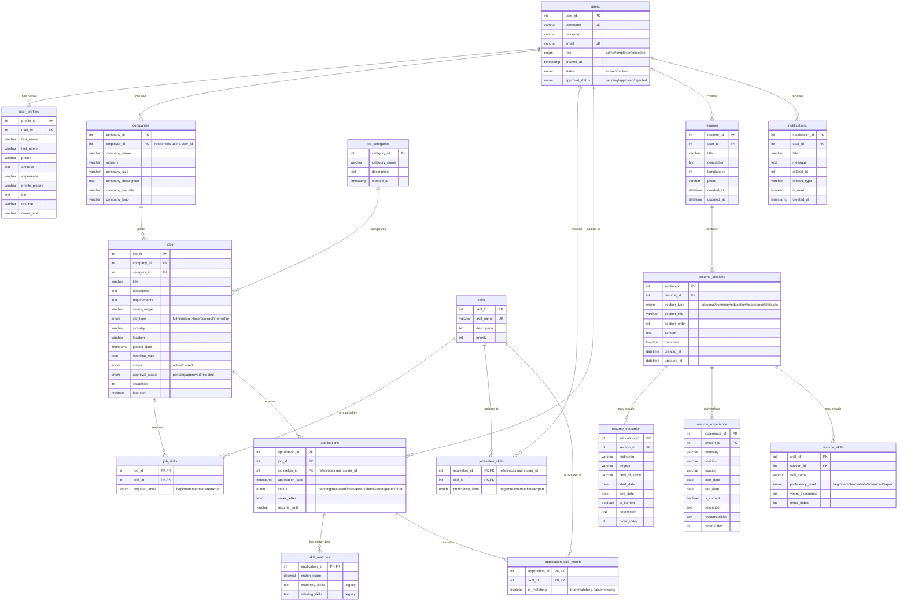

# Normalized Database ERD

## Key Features of the Normalized Structure

1. **Clear Entity Relationships**:
   - All relationships are properly defined with appropriate cardinality
   - Foreign keys are explicitly marked

2. **Bridge Tables for Many-to-Many Relationships**:
   - `job_skills`: Connects jobs to required skills
   - `jobseeker_skills`: Connects users to their skills
   - `application_skill_match`: Normalized way to store skill matches

3. **User Data Consolidation**:
   - User profile data consolidated in `user_profiles` table
   - Proper relation to the `users` table

4. **Elimination of Text-Based Lists**:
   - Skills stored in proper relationship tables
   - No more comma-separated lists

5. **Support for Complex Resume Structure**:
   - Hierarchical resume design with sections and components
   - Allows for rich resume content while maintaining normalization 